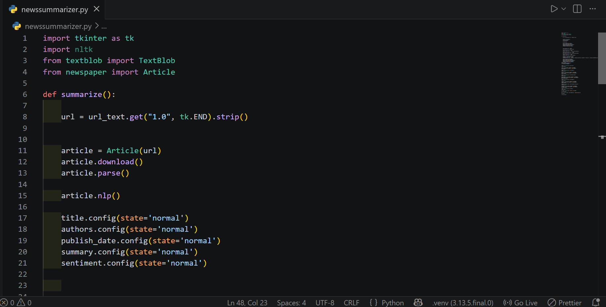
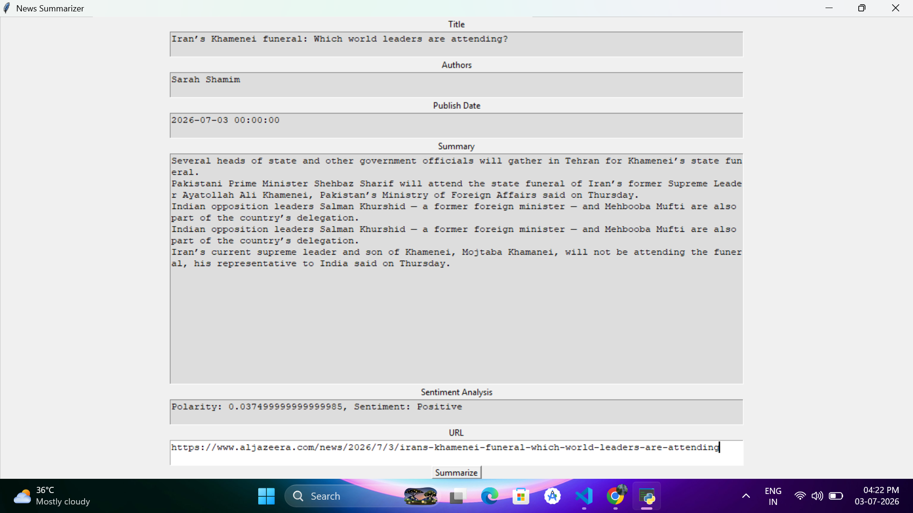

# 📰 News Summarizer using Machine Learning

An intelligent desktop application built with **Python**, **Natural Language Processing (NLP)**, and **Machine Learning** that automatically extracts, summarizes, and analyzes news articles from a given URL. The application helps users quickly understand lengthy news articles by generating concise summaries and performing sentiment analysis.

---

## 📖 Overview

Reading lengthy news articles can be time-consuming. This project simplifies news consumption by automatically extracting the most important information from an online article and presenting it in a short, readable summary. It also analyzes the sentiment of the article to determine whether it is **Positive**, **Negative**, or **Neutral**.

---

## ✨ Features

- 📰 Extracts news articles from any valid news URL
- 📌 Displays article title
- 👤 Displays author(s)
- 📅 Displays publication date
- 📝 Generates an automatic summary
- 😊 Performs sentiment analysis
- 🖥️ User-friendly desktop GUI built with Tkinter
- ⚡ Fast and lightweight application

---

## 📸 Screenshots

### 💻 Project Structure



---

### 📰 Application Interface



---

## 🛠️ Tech Stack

- Python
- Tkinter
- Natural Language Processing (NLP)
- Newspaper3k
- NLTK
- TextBlob
- Machine Learning Concepts

---

## 📂 Project Structure

```
News-Summarizer-using-Machine-Learning/
│
├── newssummarizer.py
├── README.md
├── LICENSE
│
├── images/
│   ├── project-structure.png
│   └── news-summarizer.png

```

## ⚙️ Installation

### Clone the repository

```bash
git clone https://github.com/aatifamugheer/News-Summarizer-using-Machine-Learning
```

### Navigate to the project

```bash
cd News-Summarizer-using-Machine-Learning
```

### Install dependencies

```bash
pip install -r requirements.txt
```

or

```bash
pip install newspaper3k nltk textblob lxml_html_clean
```

---

## ▶️ Run the Application

```bash
python newssummarizer.py
```

---

## 🚀 How to Use

1. Launch the application.
2. Paste a news article URL into the URL field.
3. Click **Summarize**.
4. Wait for the article to be processed.
5. View:
   - Article Title
   - Author(s)
   - Publication Date
   - Summary
   - Sentiment Analysis

---

## 🧠 Working Principle

The application follows these steps:

1. Accepts a news article URL.
2. Downloads the article using **Newspaper3k**.
3. Parses the article content.
4. Applies NLP techniques.
5. Generates a concise summary.
6. Performs sentiment analysis using **TextBlob**.
7. Displays all extracted information in the GUI.

---

## 📊 Sample Output

| Feature | Result |
|----------|--------|
| Title | ✔ |
| Author | ✔ |
| Publish Date | ✔ |
| Summary | ✔ |
| Sentiment | Positive / Negative / Neutral |

---

## 📦 Required Libraries

```
tkinter
newspaper3k
nltk
textblob
lxml_html_clean
```

## 🤝 Contributing

Contributions are welcome!

1. Fork the repository
2. Create a feature branch

```bash
git checkout -b feature-name
```

3. Commit your changes

```bash
git commit -m "Add new feature"
```

4. Push to GitHub

```bash
git push origin feature-name
```

5. Open a Pull Request.

---

## 📄 License

This project is licensed under the **MIT License**.

---

## 👩‍💻 Author

**Aatifa Mugheer**

## ⭐ Support

If you found this project helpful, please consider giving it a **Star ⭐** on GitHub.

It motivates future development and helps others discover the project.
